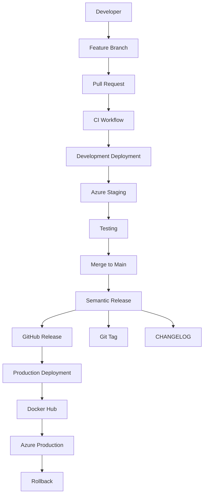
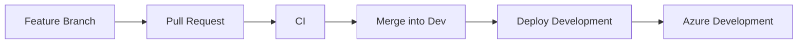
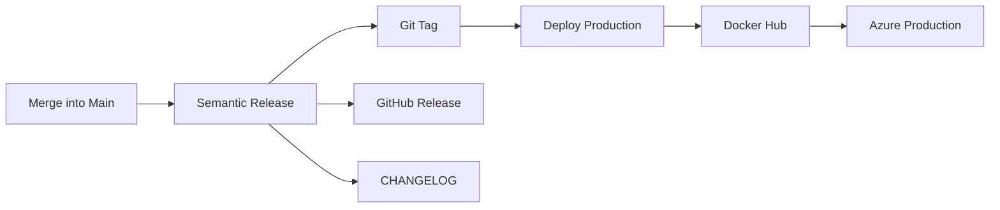
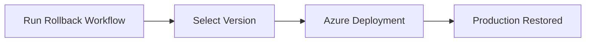
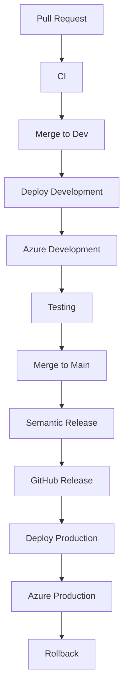
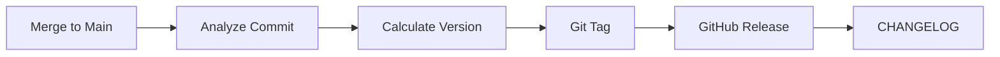
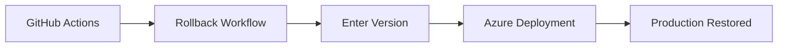
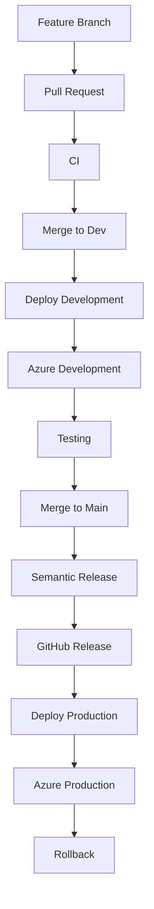

# 🚀 GPUScout CI/CD Pipeline

> A production-ready CI/CD pipeline for GPUScout built using **GitHub Actions**, **Docker**, **Docker Hub**, **Azure App Service**, and **Semantic Release**.

This project demonstrates a complete DevOps workflow, automating everything from code integration to production deployment with versioned Docker images and one-click rollback support.

The pipeline follows modern DevOps best practices, ensuring:

- Automated Continuous Integration (CI)
- Continuous Deployment (CD)
- Semantic Versioning
- Docker Image Versioning
- Azure App Service Deployment
- GitHub Release Automation
- Production Rollback

---

## 📌 Project Goals

The primary objective of this project is to build a fully automated deployment pipeline that minimizes manual intervention while ensuring reliability, consistency, and traceability across all deployments.

Every production deployment is:

- Automatically versioned
- Tagged in Git
- Released on GitHub
- Published to Docker Hub
- Deployed to Azure
- Rollback-ready

---

## ✨ Key Highlights

- 🔄 Automated CI/CD using GitHub Actions
- 🐳 Dockerized Frontend & Backend
- ☁️ Azure App Service Deployment
- 📦 Docker Hub Image Registry
- 🏷️ Semantic Versioning (v1.0.0, v1.0.1...)
- 📜 Automatic CHANGELOG Generation
- 🚀 GitHub Releases
- 🔙 One-click Production Rollback

## System Overview

```text
Developer
      │
      ▼
Feature Branch
      │
      ▼
Pull Request
      │
      ▼
GitHub Actions CI
      │
      ▼
Development Deployment
      │
      ▼
Azure Staging
      │
      ▼
Testing
      │
      ▼
Merge to Main
      │
      ▼
Semantic Release
      │
      ▼
Docker Build
      │
      ▼
Docker Hub
      │
      ▼
Azure Production
      │
      ▼
Rollback Support
```

# ✨ Features

## Continuous Integration

- Automatic build validation
- Docker image verification
- Pull Request validation
- Branch protection support

---

## Continuous Deployment

- Automatic deployment to Development
- Automatic deployment to Production
- Azure App Service integration

---

## Release Automation

- Semantic Versioning
- Conventional Commits
- GitHub Releases
- Git Tags
- Automatic CHANGELOG

---

## Docker

- Multi-stage Docker Builds
- Versioned Images
- Latest Tag
- Docker Buildx Support

---

## Operations

- Manual Production Rollback
- Version-based Deployments
- GitHub Actions Automation

# 🏗️ Architecture



# 📂 Repository Structure

```text
.
├── backend/
│   ├── Dockerfile
│   └── ...
│
├── frontend/
│   ├── Dockerfile
│   └── ...
│
├── .github/
│   └── workflows/
│       ├── ci.yml
│       ├── deploy-dev.yml
│       ├── release.yml
│       ├── deploy-prod.yml
│       └── rollback.yml
│
├── CHANGELOG.md
├── package.json
├── package-lock.json
└── .releaserc.json
```

# 🛠️ Tech Stack

The CI/CD pipeline leverages modern DevOps tools and cloud services to automate the complete software delivery lifecycle.

| Category | Technology | Purpose |
|----------|------------|---------|
| Version Control | Git & GitHub | Source code management |
| CI/CD | GitHub Actions | Build, test, release and deployment automation |
| Containerization | Docker | Package applications into containers |
| Container Registry | Docker Hub | Store and distribute Docker images |
| Cloud Platform | Microsoft Azure | Host frontend and backend services |
| Hosting Service | Azure App Service | Deploy Docker containers |
| Versioning | Semantic Release | Automatic semantic versioning |
| Release Notes | CHANGELOG.md | Automatic release documentation |
| Backend | Node.js + Express | REST API |
| Frontend | React + Vite | User Interface |
| Workflow | GitHub Workflows | CI/CD automation |

---

## Why These Technologies?

### GitHub Actions

GitHub Actions serves as the automation engine for the entire pipeline. Every push, pull request, release, and deployment is executed automatically through GitHub workflows.

---

### Docker

Docker ensures that the application behaves consistently across local development, testing, and production environments.

Benefits:

- Consistent runtime
- Easy deployment
- Platform independent
- Faster delivery

---

### Docker Hub

Docker Hub acts as the central image registry where every application version is stored.

Example:

```
codeit09/gpuscoutbackend:latest
codeit09/gpuscoutbackend:v1.0.0
codeit09/gpuscoutbackend:v1.0.1
```

---

### Azure App Service

Azure App Service hosts both the frontend and backend containers.

Advantages:

- Managed infrastructure
- Automatic scaling
- HTTPS support
- Easy Docker integration

---

### Semantic Release

Semantic Release automatically determines the next application version based on commit messages.

Example:

```
feat: Add GPU search endpoint
```

↓

```
v1.1.0
```

```
fix: Resolve API timeout
```

↓

```
v1.1.1
```

No manual version updates are required.

# 🔄 CI/CD Pipeline

The project follows a fully automated Continuous Integration and Continuous Deployment pipeline.

Every code change passes through multiple stages before reaching production.

---

## Pipeline Overview

```text
Developer

      │

      ▼

Feature Branch

      │

      ▼

Pull Request

      │

      ▼

CI Workflow

      │

      ▼

Development Deployment

      │

      ▼

Azure Development

      │

      ▼

Testing

      │

      ▼

Merge to Main

      │

      ▼

Semantic Release

      │

      ▼

Docker Build

      │

      ▼

Docker Hub

      │

      ▼

Production Deployment

      │

      ▼

Azure Production
```

---

## Development Flow



---

## Production Flow



---

## Rollback Flow



---

## Pipeline Objectives

The CI/CD pipeline is designed to achieve the following goals:

- Reduce manual deployment effort
- Ensure reproducible deployments
- Maintain deployment history
- Support versioned releases
- Enable rapid rollback
- Improve release reliability

# 🌿 Git Branching Strategy

The project follows a simplified Git Flow strategy.

```text
feature/*
      │
      ▼
dev
      │
      ▼
main
```

---

## Branches

### feature/*

Used for developing new features or bug fixes.

Example:

```
feature/login
feature/docker
feature/release-automation
```

---

### dev

Acts as the integration branch.

Every feature branch is merged into `dev`.

Automatic deployment is triggered after every successful merge.

Purpose:

- Integration testing
- QA
- Azure Development Environment

---

### main

Represents the production-ready codebase.

Only stable code is merged into `main`.

Every merge triggers:

- Semantic Release
- Docker Build
- Docker Push
- Azure Production Deployment

---

## Development Workflow

```text
Create Feature Branch

↓

Develop Feature

↓

Commit Changes

↓

Push Branch

↓

Create Pull Request

↓

Code Review

↓

Merge into Dev

↓

Testing

↓

Merge into Main

↓

Production
```

# 🔐 GitHub Branch Protection

To maintain code quality, branch protection rules are enabled.

---

## Protected Branches

- dev
- main

---

## Rules

- Require Pull Request before merging
- Prevent direct pushes
- Require successful CI checks
- Require code review
- Automatically dismiss stale reviews

---

## Benefits

- Prevent accidental deployments
- Maintain code quality
- Improve collaboration
- Protect production code

# 🐳 Docker Image Versioning

The project uses Semantic Versioning for Docker images.

Every production release generates two image tags.

Example:

```
latest
v1.0.0
```

Next release:

```
latest
v1.0.1
```

Docker Hub will contain:

```
codeit09/gpuscoutbackend

├── latest
├── v1.0.0
├── v1.0.1
└── v1.1.0
```

The frontend follows the same versioning strategy.

---

## Why Versioned Images?

Versioned Docker images provide:

- Deployment history
- Traceability
- Easy rollback
- Immutable releases

Without rebuilding, Azure can redeploy any previous image version.

# ☁️ Azure Infrastructure

The application is deployed on Microsoft Azure App Service.

---

## Production Resources

Backend

```
gpuscoutbackend
```

Frontend

```
gpuscoutfrontend
```

---

## Development Resources

Development deployments target Azure staging slots for testing before production.

---

## Deployment Architecture

```text
Docker Hub

Backend Image

↓

Azure Backend App Service

-------------------------------

Docker Hub

Frontend Image

↓

Azure Frontend App Service
```

---

## Advantages

- Managed hosting
- HTTPS enabled
- Docker native deployment
- Zero server management
- Scalable infrastructure

# ⚙️ GitHub Actions Workflows

The project uses GitHub Actions to automate the entire software delivery lifecycle.

Each workflow has a dedicated responsibility, making the pipeline modular, maintainable, and scalable.

---

## Workflow Overview

| Workflow | Purpose | Trigger |
|----------|---------|---------|
| `ci.yml` | Build & validate application | Pull Request / Push |
| `deploy-dev.yml` | Deploy development environment | Push to `dev` |
| `release.yml` | Generate semantic release | Push to `main` |
| `deploy-prod.yml` | Deploy production | After successful Release |
| `rollback.yml` | Redeploy previous production version | Manual |

---

## Workflow Architecture



---

# 1. CI Workflow (`ci.yml`)

## Purpose

The CI workflow validates every code change before it is merged into the repository.

Its primary responsibilities include:

- Installing dependencies
- Building frontend
- Building backend
- Validating Docker builds
- Detecting build failures early

---

## Trigger

```yaml
on:
  pull_request:
  push:
```

---

## Execution Flow

```text
Checkout Code

↓

Install Dependencies

↓

Build Backend

↓

Build Frontend

↓

Docker Build Validation

↓

Success
```

---

## Benefits

- Prevents broken code from being merged
- Ensures every Pull Request is buildable
- Detects dependency issues early

---

# 2. Development Deployment (`deploy-dev.yml`)

## Purpose

Automatically deploys the latest development build to Azure whenever changes are merged into the `dev` branch.

---

## Trigger

```yaml
on:
  push:
    branches:
      - dev
```

---

## Execution Flow

```text
Push to dev

↓

Build Docker Images

↓

Push Docker Images

↓

Azure Login

↓

Deploy Backend

↓

Deploy Frontend
```

---

## Docker Tags

Development deployment uses

```
dev
```

or commit SHA tags depending on the project configuration.

---

## Benefits

- Continuous deployment
- Instant testing environment
- Fast developer feedback

---

# 3. Release Workflow (`release.yml`)

## Purpose

Automatically creates production releases using Semantic Release.

---

## Trigger

```yaml
on:
  push:
    branches:
      - main
```

---

## Responsibilities

- Analyze commits
- Calculate next version
- Generate CHANGELOG
- Create Git Tag
- Publish GitHub Release

---

## Release Flow

```text
Merge to Main

↓

Analyze Commits

↓

Determine Version

↓

Create Git Tag

↓

Generate CHANGELOG

↓

Publish GitHub Release
```

---

## Example

```
feat: Add authentication
```

↓

```
v1.1.0
```

---

```
fix: Resolve API timeout
```

↓

```
v1.1.1
```

---

# 4. Production Deployment (`deploy-prod.yml`)

## Purpose

Deploy the latest released Docker images to Azure Production.

Unlike the development workflow, production deployment only begins after a successful Release.

---

## Trigger

```yaml
workflow_run:
    workflows:
      - Release
```

---

## Execution Flow

```text
Release Completed

↓

Fetch Latest Git Tag

↓

Build Docker Images

↓

Push latest

↓

Push v1.x.x

↓

Azure Login

↓

Deploy Backend

↓

Deploy Frontend
```

---

## Image Tags

Example

```
latest

v1.0.0
```

Next Release

```
latest

v1.0.1
```

---

## Advantages

- Immutable deployments
- Version tracking
- Rollback support

---

# 5. Rollback Workflow (`rollback.yml`)

## Purpose

Restore a previous production release without rebuilding Docker images.

---

## Trigger

```yaml
workflow_dispatch
```

---

## Execution Flow

```text
Run Workflow

↓

Enter Version

↓

Azure Login

↓

Deploy Backend

↓

Deploy Frontend

↓

Rollback Complete
```

---

## Example

Input

```
v1.0.0
```

Azure deploys

```
Backend

codeit09/gpuscoutbackend:v1.0.0

Frontend

codeit09/gpuscoutfrontend:v1.0.0
```

---

## Benefits

- Recovery in minutes
- No Docker rebuild
- No code changes
- Safe production rollback

# 🚀 Semantic Release

The project uses Semantic Release to fully automate version management and release generation.

No manual version updates are required.

---

## How It Works



---

## Configuration

The project is configured using:

```
.releaserc.json
```

This configuration defines:

- Release branches
- Changelog generation
- GitHub Releases
- Conventional Commit rules

---

## Versioning Strategy

The project follows Semantic Versioning.

```
MAJOR.MINOR.PATCH
```

Example

```
v1.2.3
```

---

### Major

Breaking changes

```
2.0.0
```

---

### Minor

New features

```
1.3.0
```

---

### Patch

Bug fixes

```
1.3.1
```

---

## Conventional Commits

Examples

Feature

```
feat: add gpu filtering
```

Bug Fix

```
fix: resolve login issue
```

Documentation

```
docs: update README
```

Refactor

```
refactor: optimize docker build
```

Performance

```
perf: improve api response
```

CI/CD

```
ci: update deploy workflow
```

---

## Automatic Release Artifacts

Each production release generates:

- Git Tag
- GitHub Release
- Release Notes
- CHANGELOG update

# 🔙 Production Rollback

One of the key features of this pipeline is the ability to restore any previous production release.

No rebuild is required.

---

## Why Rollback?

Suppose version

```
v1.0.2
```

introduces a production issue.

Instead of rebuilding an older commit, simply redeploy

```
v1.0.1
```

---

## Rollback Flow



---

## Steps

1. Open GitHub Actions

2. Select

```
Rollback Production
```

3. Click

```
Run Workflow
```

4. Enter

```
v1.0.0
```

5. Click

```
Run
```

Azure automatically redeploys the selected version.

---

## Advantages

- No Docker rebuild
- No Git revert
- No new release
- Fast recovery
- Version consistency

# 🌍 Environment Variables

The project uses environment variables to separate configuration from source code.

## Backend

| Variable | Description |
|----------|-------------|
| PORT | Server Port |
| MONGODB_URI | MongoDB Connection String |
| JWT_SECRET | Authentication Secret |
| NODE_ENV | Runtime Environment |

---

## Frontend

| Variable | Description |
|----------|-------------|
| VITE_BACKEND_URL | Backend API URL |

---

## Why Environment Variables?

- Security
- Portability
- Easy deployment
- Configuration management

# 🔑 GitHub Secrets

Sensitive information is securely stored using GitHub Secrets.

---

## Required Secrets

| Secret | Purpose |
|---------|---------|
| AZURE_CREDENTIALS | Azure Authentication |
| DOCKER_USERNAME | Docker Hub Username |
| DOCKER_PASSWORD | Docker Hub Access Token |

---

## Why Secrets?

Secrets prevent sensitive credentials from being exposed in the source code or Git history.

All deployment workflows retrieve credentials securely at runtime.

# 💻 Local Development Setup

This section explains how to set up the project locally for development.

---

## Prerequisites

Ensure the following tools are installed on your system.

| Tool | Version |
|------|---------|
| Git | Latest |
| Node.js | v24+ |
| npm | Latest |
| Docker Desktop | Latest |
| Azure CLI | Latest (Optional) |

---

## Clone Repository

```bash
git clone https://github.com/<your-username>/<repository>.git

cd <repository>
```

---

## Install Dependencies

```bash
npm install
```

If your frontend and backend have separate dependencies:

```bash
cd backend
npm install

cd ../frontend
npm install
```

---

## Configure Environment Variables

Backend

```env
PORT=3000
MONGODB_URI=<your-mongodb-uri>
JWT_SECRET=<your-secret>
NODE_ENV=development
```

Frontend

```env
VITE_BACKEND_URL=http://localhost:3000
```

---

## Run Backend

```bash
cd backend

npm run dev
```

---

## Run Frontend

```bash
cd frontend

npm run dev
```

---

## Build Docker Images

Backend

```bash
docker build -t gpuscoutbackend ./backend
```

Frontend

```bash
docker build -t gpuscoutfrontend ./frontend
```

---

## Verify Containers

```bash
docker images
```

You should see

```
gpuscoutbackend

gpuscoutfrontend
```

---

## Local Development Architecture

```text
Developer

↓

React Frontend

↓

Express Backend

↓

MongoDB
```

---

## Useful Commands

Start Docker

```bash
docker compose up
```

Stop Docker

```bash
docker compose down
```

View Logs

```bash
docker logs <container-id>
```

Remove Containers

```bash
docker system prune
```

# 🚀 End-to-End Deployment Walkthrough

This section explains the complete lifecycle of a code change, from development to production.

---

## Step 1 — Create Feature Branch

```bash
git checkout -b feature/new-feature
```

---

## Step 2 — Develop Feature

Implement the required functionality.

Example:

- Add API endpoint
- Improve frontend
- Fix a bug

---

## Step 3 — Commit Changes

Follow Conventional Commits.

Example

```bash
git commit -m "feat: add gpu filtering"
```

---

## Step 4 — Push Branch

```bash
git push origin feature/new-feature
```

---

## Step 5 — Create Pull Request

Open a Pull Request targeting the `dev` branch.

GitHub automatically starts the CI workflow.

```text
Feature Branch

↓

Pull Request

↓

CI Workflow
```

---

## Step 6 — Merge into Dev

After approval, merge into `dev`.

Automatically triggered:

- Build Docker Images
- Push Docker Images
- Deploy Development Environment

```text
Dev

↓

Azure Development
```

---

## Step 7 — Testing

Validate the application in the Azure Development environment.

Verify:

- Backend APIs
- Frontend UI
- Database connectivity
- Authentication
- Application logs

---

## Step 8 — Merge into Main

Once testing is complete, create a Pull Request from

```
dev

↓

main
```

---

## Step 9 — Semantic Release

The Release workflow automatically

- Calculates next version
- Generates CHANGELOG
- Creates Git Tag
- Publishes GitHub Release

Example

```
v1.0.2
```

---

## Step 10 — Production Deployment

The Production workflow automatically

- Fetches release version
- Builds Docker images
- Pushes versioned images
- Deploys Azure Production

Example

```
Backend

codeit09/gpuscoutbackend:v1.0.2

Frontend

codeit09/gpuscoutfrontend:v1.0.2
```

---

## Step 11 — Production Available

The latest version is now available for users.

Deployment completed successfully.

---

## Step 12 — Rollback (If Required)

Navigate to

```
GitHub

↓

Actions

↓

Rollback Production
```

Input

```
v1.0.1
```

Azure redeploys the selected version.

---

## Complete Workflow



# 🛠️ Troubleshooting

This section covers common issues encountered during development and deployment.

---

## Docker Build Failed

### Possible Causes

- Incorrect Dockerfile
- Missing dependencies
- Invalid build arguments

### Solution

```bash
docker build .
```

Review the build logs for the exact error.

---

## Azure Deployment Failed

### Possible Causes

- Invalid Azure credentials
- App Service unavailable
- Incorrect Docker image tag

### Solution

Verify:

- Azure Credentials
- App Service Name
- Docker Image Tag

---

## Semantic Release Not Running

### Possible Causes

- Merge not performed on `main`
- Invalid commit messages
- Missing permissions

### Solution

Ensure commits follow Conventional Commits.

Example

```
feat:

fix:

docs:
```

---

## Docker Image Not Found

Verify available tags

```bash
docker pull codeit09/gpuscoutbackend:v1.0.0
```

---

## Rollback Failed

Possible causes

- Version does not exist
- Docker image deleted
- Azure deployment failure

Verify that the requested version exists in Docker Hub.

---

## CI Failed

Common causes

- Build errors
- Dependency conflicts
- Syntax errors

Review the GitHub Actions logs for detailed diagnostics.

# 🔮 Future Improvements

The current CI/CD pipeline provides a production-ready deployment workflow.

Potential future enhancements include:

- Container vulnerability scanning
- Automated deployment notifications
- Performance monitoring
- Multi-region deployments
- Kubernetes deployment
- Blue-Green deployment strategy
- Canary deployments
- Infrastructure as Code (Terraform/Bicep)
- Automated testing before deployment
- Monitoring dashboards
- Centralized logging
- Auto scaling

# 🤝 Contributing

Contributions are welcome.

If you'd like to improve the project:

1. Fork the repository.
2. Create a feature branch.
3. Commit your changes using Conventional Commits.
4. Open a Pull Request.

Please ensure that all GitHub Actions workflows pass successfully before requesting a review.

# 📄 License

This project is licensed under the MIT License.

See the LICENSE file for more details.

# 🙏 Acknowledgements

This project leverages the following technologies and platforms:

- GitHub
- GitHub Actions
- Docker
- Docker Hub
- Microsoft Azure
- Semantic Release
- Node.js
- Express.js
- React
- Vite

Special thanks to the open-source community for providing the tools and frameworks that made this project possible.

