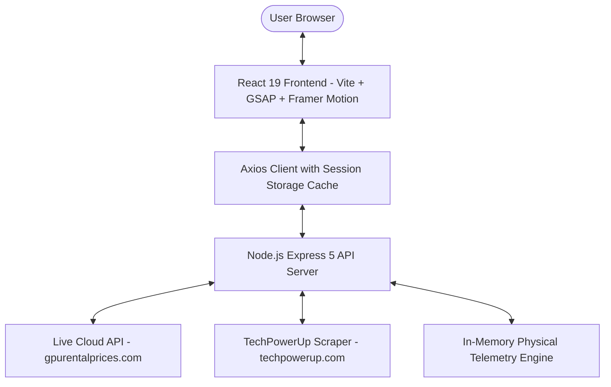

# InferCloud — High-Performance GPU Rental & Silicon Telemetry Engine

[](LICENSE)
[](https://nodejs.org/)
[](https://react.dev/)
[](https://expressjs.com/)
[]()
[](https://github.com/semantic-release/semantic-release)

> **InferCloud** is an enterprise-grade silicon intelligence and cloud compute marketplace platform. It offers real-time GPU rental price aggregation, physical hardware telemetry, workstation/mobile edge profiling, cost-of-ownership (TCO) analytics, and live TechPowerUp specification scraping.

---

## 📋 Table of Contents

- [Overview](#-overview)
- [Key Features](#-key-features)
- [Architecture & Tech Stack](#-architecture--tech-stack)
- [Repository Structure](#-repository-structure)
- [Quick Start](#-quick-start)
  - [Prerequisites](#prerequisites)
  - [Local Development Setup](#local-development-setup)
  - [Docker Containerization](#docker-containerization)
- [Environment Configuration](#-environment-configuration)
- [API Reference](#-api-reference)
- [Frontend Design System](#-frontend-design-system)
- [CI/CD & Release Pipeline](#-cicd--release-pipeline)
- [Contributing](#-contributing)
- [License](#-license)

---

## 🔭 Overview

In the rapidly evolving AI infrastructure landscape, decision-makers face complex trade-offs between **CapEx (direct physical hardware procurement)** and **OpEx (on-demand cloud rentals)**.

InferCloud bridges this gap by unifying:

1. **Live Cloud Offer Aggregation**: Real-time pricing from neoclouds (RunPod, Vast.ai, Lambda Labs, E2E Networks, Cyfuture, AceCloud).
2. **Physical Hardware Telemetry**: Specs and pricing metrics for consumer flagship GPUs (RTX 5090, RTX 4090) and enterprise accelerators (H100, H200, B200, L40S).
3. **Live TechPowerUp Engine**: Scrapes and parses hardware specs and TechSpot review metadata on-the-fly for any searched GPU model.
4. **TCO & Inflection Analysis**: Interactive workload profiling to model CapEx breakeven points against hourly cloud rental rates.

---

## ⚡ Key Features

- 🛰️ **Live Cloud Price Sync**: Intercepts live data feeds from global cloud providers with sub-second fallback mechanisms.
- 🔬 **Real-Time TechPowerUp Scraper**: Scrapes AJAX endpoints from `techpowerup.com` to extract core counts, bus widths, memory types, and process nodes dynamically.
- 📊 **TCO & Amortization Modeler**: Interactive sliders and Recharts visualization displaying cost cross-over points for 24/7 vs. ad-hoc usage.
- 🔍 **Unified Hardware Search**: Global search overlay indexing local GPUs, cloud hosts, edge workstations, and mobile devices simultaneously.
- 🎨 **Editorial Claude Canvas Aesthetics**: Premium warm-cream interface (`#faf9f5`) paired with glassmorphism, GSAP animations, and Framer Motion transitions.
- 🧭 **Centering MacOS Dock Navbar**: Floating bottom navigation with responsive scaling and transform-isolated layout wrappers.
- 💾 **Session Cache & Memory Management**: Browser-side `sessionStorage` caching with automatic reload invalidation to keep telemetry updated.
- 🐳 **Production Docker & Nginx Ready**: Multi-stage Dockerfiles and Nginx reverse-proxy setup for scalable deployment.

---

## 🏗️ Architecture & Tech Stack


```mermaid
graph TD
    User([User Browser]) <--> ReactUI[React 19 Frontend - Vite + GSAP + Framer Motion]
    ReactUI <--> APIClient[Axios Client with Session Storage Cache]
    APIClient <--> ExpressBackend[Node.js Express 5 API Server]
    ExpressBackend <--> LiveCloud[Live Cloud API - gpurentalprices.com]
    ExpressBackend <--> TPU[TechPowerUp Scraper - techpowerup.com]
    ExpressBackend <--> SeedData[In-Memory Physical Telemetry Engine]
```

### Core Technologies

| Layer                     | Technology                                       | Purpose                                            |
| :------------------------ | :----------------------------------------------- | :------------------------------------------------- |
| **Frontend Framework**    | React 19, Vite 8                                 | Ultra-fast client-side application bundle          |
| **Styling & Motion**      | Vanilla CSS, Framer Motion, GSAP (ScrollTrigger) | Modern editorial canvas aesthetic & animations     |
| **Visualization**         | Recharts                                         | Interactive bandwidth and TCO chart visualizations |
| **Backend Runtime**       | Node.js (ES Modules), Express 5                  | High-throughput asynchronous backend server        |
| **Data Fetching & Cache** | Axios, SessionStorage                            | Local client caching with invalidation on refresh  |
| **Containerization**      | Docker, Nginx                                    | Multi-container setup for production deployment    |
| **Release Management**    | Semantic Release, GitHub Actions                 | Automated versioning and release notes             |

---

## 📁 Repository Structure

```
InferCloud/
├── backend/                  # Node.js Express API Server
│   ├── src/
│   │   ├── controllers/      # Telemetry, search, and scraper handlers
│   │   ├── db/               # Static seed telemetry datasets
│   │   ├── routes/           # Express v5 GPU route definitions
│   │   ├── utils/            # ApiResponse and asyncHandler wrappers
│   │   ├── app.js            # Express app configuration & middleware
│   │   └── server.js         # Entry point (HTTP server)
│   ├── .env.example          # Backend environment template
│   └── Dockerfile            # Backend Node.js container setup
├── frontend/                 # React 19 Single Page Application
│   ├── src/
│   │   ├── api/              # Axios API service wrapper with caching
│   │   ├── components/       # UI components (Modal, Table, Cards, Dock)
│   │   ├── App.jsx           # Main application state & orchestration
│   │   ├── main.jsx          # React DOM entry point
│   │   └── index.css         # Unified design system & CSS custom properties
│   ├── .env.example          # Frontend environment template
│   ├── Dockerfile            # Frontend multi-stage Nginx build
│   ├── nginx.conf            # Nginx web server configuration
│   └── vite.config.js        # Vite bundler & dev proxy configuration
├── .github/workflows/        # GitHub Actions CI/CD workflows
├── CICD Pipeline.md          # CI/CD Architecture & pipeline docs
└── README.md                 # Master repository documentation
```

---

## 🚀 Quick Start

### Prerequisites

Ensure you have the following installed locally:

- **Node.js**: `v18.0.0` or higher
- **npm**: `v9.0.0` or higher
- **Docker & Docker Compose** _(Optional, for containerized run)_

### Local Development Setup

1. **Clone the repository**:

   ```bash
   git clone https://github.com/sayan-evdpl/InferCloud.git
   cd InferCloud
   ```

2. **Setup and run the Backend**:

   ```bash
   cd backend
   cp .env.example .env
   npm install
   npm run dev
   ```

   _The backend server starts on `http://localhost:3000`._

3. **Setup and run the Frontend** (in a new terminal):

   ```bash
   cd frontend
   cp .env.example .env
   npm install
   npm run dev
   ```

   _The frontend dev server starts on `http://localhost:5173`._

4. Open your browser and navigate to `http://localhost:5173`.

---

### Docker Containerization

To run the full stack via Docker containers:

#### Backend Container

```bash
cd backend
docker build -t infercloud-backend .
docker run -d -p 3000:3000 --name backend infercloud-backend
```

#### Frontend Container (Nginx)

```bash
cd frontend
docker build -t infercloud-frontend .
docker run -d -p 80:80 --name frontend infercloud-frontend
```

---

## ⚙️ Environment Configuration

### Backend Environment Variables (`backend/.env`)

| Variable      | Default Value           | Description                               |
| :------------ | :---------------------- | :---------------------------------------- |
| `PORT`        | `3000`                  | Port for Express HTTP server              |
| `CORS_ORIGIN` | `http://localhost:5173` | Allowed CORS origin for frontend requests |
| `NODE_ENV`    | `development`           | Runtime environment mode                  |

### Frontend Environment Variables (`frontend/.env`)

| Variable           | Default Value           | Description               |
| :----------------- | :---------------------- | :------------------------ |
| `VITE_BACKEND_URL` | `http://localhost:3000` | Base URL for API requests |

---

## 📡 API Reference

Base Endpoint: `/api/v1/gpus`

| Method | Endpoint          | Description                                                           | Query Parameters                                |
| :----- | :---------------- | :-------------------------------------------------------------------- | :---------------------------------------------- |
| `GET`  | `/search`         | Global search across local GPUs, cloud offers, and systems            | `q` _(string)_                                  |
| `GET`  | `/local`          | Returns physical GPUs with in-memory filtering & TPU scraper fallback | `page`, `limit`, `sort`, `arch`, `minVram`, `q` |
| `GET`  | `/cloud`          | Returns grouped live cloud rental offers & provider metrics           | `page`, `limit`                                 |
| `GET`  | `/systems`        | Returns workstations, OEM desktops, and mobile compute                | `page`, `limit`, `formFactor`                   |
| `GET`  | `/tco`            | Computes TCO graph data and CapEx breakeven analysis                  | `hours` _(number, default: 8)_                  |
| `GET`  | `/bandwidth`      | Returns memory bandwidth comparison dataset                           | None                                            |
| `GET`  | `/external-specs` | Scrapes real-time hardware specs & reviews from TechPowerUp/TechSpot  | `name` _(string, required)_                     |

---

## 🎨 Frontend Design System

InferCloud follows Anthropic's editorial design philosophy:

- **Canvas Color**: Warm Tinted Cream (`#faf9f5`)
- **Primary Brand Accent**: Warm Coral (`#cc785c`)
- **Typography**: Slab Serif Display paired with StyreneB / Inter body sans.
- **Glassmorphism**: Subtle backdrop blur (`backdrop-filter: blur(12px)`) with hairline borders.

---

## 🔄 CI/CD & Release Pipeline

The repository integrates automated semantic release and versioning via **GitHub Actions**:

- **Automated Changelogs**: Generates `CHANGELOG.md` upon every release commit.
- **Semantic Versioning**: Formats version tags based on Conventional Commits (`fix:`, `feat:`, `feat!:`, `chore:`).

---

## 🤝 Contributing

We welcome community contributions! Follow these steps:

1. Fork the project repository.
2. Create your feature branch (`git checkout -b feature/amazing-feature`).
3. Commit your changes using Conventional Commit messages (`git commit -m 'feat: add GPU memory comparison filter'`).
4. Push to the branch (`git push origin feature/amazing-feature`).
5. Open a Pull Request.

---

## 📄 License

This project is licensed under the **ISC License**. See the [LICENSE](LICENSE) file for details.
